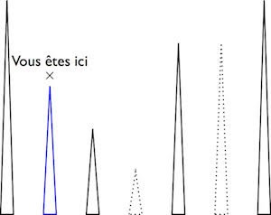
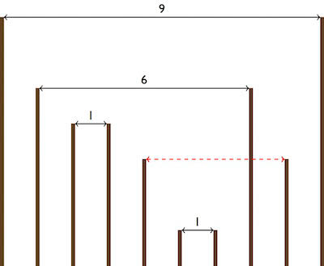

Sujets et corrigés: https://www.isograd.com/FR/solutionconcours.php

- [Mot le plus long](#mot-le-plus-long)
- [Surveillance](#surveillance)
- [Détecteur de pipotron](#d%C3%A9tecteur-de-pipotron)
- [Pylônes](#pyl%C3%B4nes)
- [Banderoles](#banderoles)

### Mot le plus long
#### Enoncé
Dans ce challenge, l'objectif est de déterminer le mot le plus long dans un dictionnaire.

#### Format des données
**Entrée**

- Ligne 1 : un entier N compris entre 10 et 1000 représentant le nombre de mots contenus dans le dictionnaire.
- Ligne 2 à N+1 : une chaîne comprenant entre 1 et 750 caractères non accentués en minuscules représentant un mot du dictionnaire.

**Sortie**

Un entier indiquant le nombre de caractère composant le mot le plus long du dictionnaire.

### Surveillance
#### Énoncé
Dans ce challenge, vous devez déterminer le nombre de personnes situées dans une zone rectangulaire. Les coordonnées des personnes et de la zone sont fournies sous forme de latitude et de longitude.

#### Format des données
**Entrée**

- Ligne 1 : quatre nombres flottants from_lat, from_lng, to_lat et to_lng tous compris entre 0 et 51 utilisant le "." comme séparateur décimal et séparés par des espaces, indiquant respectivement la latitude minimale, la longitude minimale, la latitude maximale et la longitude maximale de la zone rectangulaire à contrôler.
- Ligne 2 : un entier N représentant le nombre de personnes géolocalisées.
- Lignes 3 à N+2 : deux nombres flottants lat et lng utilisant le "." comme séparateur décimal et séparés par un espace représentant les coordonnées d'une personne géolocalisée.

**Sortie**

Un entier représentant le nombre de personnes se trouvant dans la zone à contrôler (les bords sont inclus).

### Détecteur de pipotron
#### Enoncé
Le Pipotron est un générateur automatique de phrases qui permet de facilement meubler la conversation. Le principe est que la phrase est conçue en ajoutant plusieurs composants les un derrières les autres et en ajoutant un espace entre chaque composant. Chaque composant est tiré au hasard. Par exemple, dans un Pipotron générant des phrases à 3 composants, on a une liste de possibilités pour le 1er composant, une liste de possibilités pour le 2ème composant et une liste de possibilités pour le 3ème composant. On tire au hasard un élément de la première liste, un élément de la seconde, un élément de la 3ème, on les met bout à bout en les séparant par des espaces et on obtient une phrase pleine de sens.

On peut trouver des exemples ici :
- http://richard.geneva-link.ch/excusotron.html
- http://www.lepipotron.com/
- http://www.chateauloisel.com/humour/pipotron.htm

L'objectif de ce challenge est de déterminer si une phrase est un Pipotron.

**Il n'y as pas de contrainte de complexité sur l'algorithme.**

#### Format des données
**Entrée**

- Ligne 1 : un entier n compris entre 3 et 5 représentant le nombre de composants du Pipotron.
- Ligne 2 : n entiers séparés pas des espaces représentant le nombre de chaînes possibles pour chaque composant du Pipotron. On nommera ces entiers P1,P2...Pn. Et on appellera T la somme P1 + P2 +...+ Pn.
- Ligne 3 à T + 2 : Les chaines possibles pour chaque composant du Pipotron. Chaque chaîne contient entre 2 et 150 caractères non accentués et peut contenir des majuscules et des ponctuations. Les P1 premières chaînes correspondent au premier composant puis de P1+1 à P1 + P2, les chaînes du second et ainsi de suite.
- Ligne T + 3: un entier Q représentant le nombre de phrases à vérifier.
- Ligne T + 4 à T + 3 + Q : une phrase comprenant entre 1 et 750 caractères qui peut être ou non un Pipotron.

**Sortie**

Un entier V représentant le nombre de Pipotrons dans les phrases proposées.

### Pylônes
#### Énoncé
Vous décidez de faire une petite pause dans votre carrière de développeur et de vous reconvertir dans l'installation de pylônes. Votre premier boulot consiste à installer des pylônes le long d'une vallée.

Soucieux du paysage, vous vous demandez depuis chaque pylône combien de pylônes sont visibles. Pour simplifier, un pylône A voit un pylône B s'il n'existe pas de pylône plus grand ou de la même taille que le pylône B entre le pylône A et le pylône B.

#### Exemple

Sur cette figure, les pylônes visibles depuis le 2e ont été indiqués en traits solides. Il y en a 4.
La réponse à cette entrée devra être, répartis sur 7 lignes, les entiers 3 4 5 5 6 3 2.

#### Format des données

**Entrée**

- Ligne 1 : un entier N compris entre 1 et 1000, indiquant le nombre de pylônes le long de la vallée.
- Lignes 2 à N+1 : la hauteur d'un pylône, un entier compris entre 1 et 100.

**Sortie**

N entiers séparés par des espaces représentant le nombre de pylônes visibles depuis chaque pylône.

### Banderoles
#### Énoncé
Près de chez vous, il y a un terrain vague avec des poteaux de différentes hauteurs. Pourquoi ne pas tirer parti de cet emplacement publicitaire ?

Les poteaux sont équidistants et séparés les uns des autres par une distance d'un mètre. Vous pouvez accrocher une banderole entre deux poteaux s'il n'y a pas de poteau strictement plus grand entre eux. On vous donne la hauteur de tous les poteaux, vous devez déterminer la longueur totale de banderole que vous pouvez y accrocher.

Dans cet exemple la longueur totale est de 17 (9+6+1+1).

Notez qu'il est tout à fait possible d'avoir 3 poteaux à la même hauteur, auquel cas si par exemple ils se trouvent aux positions 1 3 et 7 et qu'il n'y a pas de poteau plus haut qu'eux entre 1 et 7, on pourra accrocher une banderole de 1 à 3 et une banderole de 3 à 7 soit une longueur totale de 3 - 1 + 7 - 3 = 6.

**Votre code devra avoir une complexité N log N**

#### Format des données
**Entrée**

- Ligne 1 : un entier N compris entre 1 et 100000 indiquant le nombre de poteaux de l'entrée.
- Lignes 2 à N+1 : un entier compris entre 1 et 100000 représentant la hauteur d'un poteau. 

**Sortie**

Un entier représentant la longueur totale de banderole que vous pourrez accrocher sur les poteaux en considérant que la distance entre deux poteaux consécutifs est de 1 mètre.
