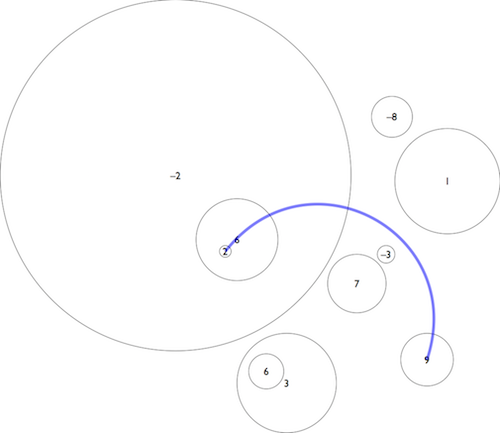

Sujets et corrigés : https://www.isograd.com/FR/solutionconcours.php

- [Gants](#gants)
- [Flocons](#flocons)
- [Topographie](#topographie)
- [Avalanches](#avalanches)
- [Snowboarding](#snowboarding)


### Gants
##### Objectif
L'hiver approche, c'est le moment de préparer vos vacances au ski. L'objectif de ce challenge est de déterminer combien de paires de gants vous pouvez constituer à partir des gants que vous trouvez dans votre tiroir. 

Une paire de gants est constituée de deux gants de même couleur.

##### Format des données

**Entrée**
- Ligne 1 : un entier N compris entre 1 et 1000 représentant le nombre de gants.
- Ligne 2 à N + 1 : une chaîne comprenant entre 1 et 7 caractères en minuscules représentant la couleur d'un gant.

**Sortie**

Un entier représentant le nombre de paires que vous pouvez constituer. Pour constituer une paire, il faut deux gants de la même couleur.


### Flocons
##### Objectif
En attendant la neige, on peut toujours dessiner des flocons.... Le but de ce challenge est de dessiner des flocons.

Pour dessiner un flocon de taille N (où N est un entier impair), vous devez créer un losange de dimension N dans une feuille comprenant N lignes et N colonnes. Chaque point non compris dans le losange est représenté par un . et chaque point du losange est représenté par un *.

**Exemples**

Si N = 3, le losange sera ainsi :

    .*.
    ***
    .*.

Si N =7, le losange sera ainsi :

    ...*...
    ..***..
    .*****.
    *******
    .*****.
    ..***..
    ...*...

##### Données
**Entrée**
- Ligne 1 : un entier impair N compris entre 3 et 51 représentant la taille du flocon.

**Sortie**

N lignes de N caractères représentant le flocon. Chaque caractère pouvant être un . ou un *.


### Topographie
##### Objectif
En montagne, on utilise des cartes topographiques qui contiennent des courbes de niveau. Tous les points d'une courbe de niveau donnée sont à la même altitude. Par conséquent, si une courbe de niveau en croise une autre cela constitue une anomalie (sinon le point de croisement aurait deux altitudes différentes). Dans ce challenge, vous allez devoir déterminer si une carte contient ou non une anomalie.

Pour simplifier le problème, on va considérer que les courbes de niveau sont des cercles dont on vous fournit les coordonnées du centre ainsi que le rayon. Toutes les courbes de niveau que l'on vous fournit représentent des altitudes différentes donc si deux lignes se touchent, c'est aussi une anomalie.

#### Données

**Entrée**
- Ligne 1 : un entier N compris entre 2 et 1500 représentant le nombre de cercles.
- Lignes 2 à N + 1 : trois entiers X, Y, et R séparés par des espaces représentant respectivement l'abscisse(X) et l'ordonnée(Y) du centre et le rayon(R) d'un cercle.

**Sortie**

La chaîne OK si la carte ne contient pas d'anomalie sinon la chaîne KO.


### Avalanches
##### Objectif
Le but de ce challenge est de trouver le chemin le moins risqué entre deux sommets. Chaque piste relie deux sommets et le risque d'avalanche de la piste est P. Chaque sommet est relié à tous les autres sommets par une piste. Par ailleurs, les probabilités d'avalanche sont indépendantes.

**Petit rappel statistique**

Si on note P(A), P(B) et P(C) les risques d'avalanche des pistes A, B et C, alors la probabilité qu'il n'y ait pas d'avalanche sur les pistes A, B et C sont respectivement 1-P(A), 1-P(B), 1-P(C). Comme les probabilités sont indépendantes, la probabilité qu'il n'y ait pas d'avalanche sur un parcours où le skieur emprunterait successivement les pistes A, B et C est :
```
(1 - P(A))*(1 - P(B))*(1 - P(C))
```

Par conséquent, la probabilité qu'il y ait au moins une avalanche sur un parcours où le skieur emprunterait successivement les pistes A, B et C est :
```
1 - (1 - P(A))*(1 - P(B))*(1 - P(C))
```


Une solution brutale force dont la complexité serait systématiquement O(n!) (c'est à dire explorant tous les chemins possibles) génèrera un timeout.

#### Données
**Entrée**
- Ligne 1 : un entier N compris entre 1 et 200 représentant le nombre de sommets.
- Ligne 2 : deux entiers différents A et B compris entre 0 et N - 1, le numéro du sommet de départ et le numéro du sommet d'arrivée.
- Lignes 3 à N + 2 : N nombres décimaux compris entre 0 et 1, séparés par des espaces. Si on nomme i le numéro de la ligne - 3, alors le j-ème nombre de la ligne représente la probabilité d'avalanche entre le sommet i et le sommet j-1.

**Sortie**

Un nombre décimal arrondi à 3 chiffres après la virgule représentant la probabilité qu'il y ait au moins une avalanche sur le chemin le moins risqué pour relier le sommet A au sommet B.


### Snowboarding
##### Objectif
Le but de ce challenge est de trouver le parcours avec le plus grand dénivelé sur un champ de bosses. On vous donne une carte topographique où les bosses et les trous sont représentés par des disques. Chaque disque a une hauteur (positive) ou une profondeur (négative). Les bosses et les trous peuvent être empilés, par contre leurs périmètres ne se croisent jamais.

Un skieur qui passe d'un disque de hauteur ou profondeur A à un disque de hauteur ou profondeur B encaisse un dénivelé de |A - B| (valeur absolue de A - B). Or, un grand dénivelé, c'est cool. Vous devez trouver le chemin le plus cool, c'est-à-dire celui qui réalise un dénivelé maximal, sans passer deux fois par le même disque.

Si le skieur passe par la zone qui n'est comprise dans aucun disque alors il est à une hauteur de 0 et il ne peut passer qu'une seule fois dans cette zone. Par ailleurs, le skieur est agile donc il sait tourner pour contourner un disque si cela est nécessaire.

Cet exercice peut être résolu en O(N log N), néanmoins pour ce concours, une solution en O(N^2) est acceptée.

**Exemple**


Dans l'exemple ci-dessus le parcours optimal est de passer par les points de hauteur suivante : 2 -> 6 -> -2 -> 0 -> 9 et correspond à un dénivelé de 23.

#### Données

**Entrée**
- Ligne 1 : un entier N compris entre 1 et 1000 représentant le nombre de disques.
- Lignes 2 à N + 1 : quatre entiers X, Y, R, et H séparés par des espaces représentant respectivement l'abscisse (X) et l'ordonnée (Y) du centre, le rayon (R) et la hauteur H (positive) ou profondeur (négative) d'un disque. X, Y et R sont compris entre 1 et 100000. H est compris entre -100000 et 100000.

**Sortie**

Un entier, représentant le dénivelé maximal que l'on peut obtenir en se baladant sur la piste sans passer deux fois par le même disque et en passant au maximum une fois par la zone qui n'est comprise dans aucun disque.
