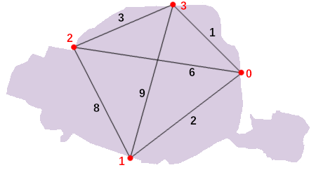

Sujets et solutions persos : https://www.isograd.com/FR/solutionconcours.php


### Le meilleur restaurant

#### Énoncé
Vous avez mis en place un site de recommandations de restaurants.
A partir des opinons laissées par les visiteurs, vous avez pu construire pour chaque restaurant 3 notes sur 20 :
- Qualité de la nourriture
- Qualité de la salle
- Qualité du service

Pour classer les restaurants, vous calculez un score qui correspond à la moyenne de ces 3 notes.


#### Format des données

**Entrée**
- Ligne 1 : un entier N compris entre 5 et 500 représentant le nombre de restaurants dans votre base.
- Lignes 2 à N+1 : trois entiers compris entre 0 et 20 et séparés par des espaces représentant respectivement les notes que vous avez calculées à partir des opinions des visiteurs pour la nourriture, la salle et le service pour un restaurant donné.

**Sortie**

Un entier représentant le score du meilleur restaurant de votre base arrondi à l'entier supérieur.


### Buffet à volonté

#### Énoncé

L'informatique c'est bien, mais la cuisine c'est encore mieux. Lassé de quitter vos cantines préférées en ayant encore faim, vous avez décidé de monter un restaurant avec un concept de buffet à volonté. Comme vous voyez grand, vous avez décidé de faire des "réductions de groupe" :- 10% sur la note pour les groupes d'au moins 4 personnes
- 20% sur la note pour les groupes d'au moins 6 personnes
- 30% sur la note pour les groupes d'au moins 10 personnes

Pour votre business plan, vous souhaitez estimer le montant des ventes en fonction du prix par personne et de la configuration des tables servies.


#### Format des données

**Entrée**
- Ligne 1 : un entier compris entre 20 et 40 correspondant au prix du buffet par personne.
- Ligne 2 : un entier N compris entre 5 et 50 correspondant au nombre de tables servies.
- Lignes 3 à N+2 : un entier compris entre 2 et 15 représentant le nombre de personnes présentes à une table.

**Sortie**

Un entier représentant le montant des ventes du restaurant arrondi à l'entier supérieur.


### Copains

#### Objectif

Vos goûts cinématographiques sont très moyens, à tel point que lorsque vous demandez à vos K meilleurs copains quelle note ils ont donnée à un film, vous l'avez généralement évalué à la moyenne de leurs notes.

Un nouvel épisode, Rocky VI, arrive au cinéma. Est-il vraiment mieux que les précédents ?
Pour protéger votre santé mentale, vous décidez de prédire votre appréciation de Rocky VI avant d'aller (ou non) le voir.

Vos N copains ont tous vus les 5 premiers épisodes Rocky (sinon ils ne seraient pas vos copains) ainsi que le nouvel épisode.
Mais pour vous, vos K meilleurs copains (K≤N) sont ceux qui comptent vraiment, même si vous n'avez pas encore décidé qui ils sont.
Pour choisir ces K copains parmi N, vous allez prendre ceux qui ont des goûts les plus similaires aux vôtres sur les 5 premiers épisodes Rocky.

La distance entre vos goûts et ceux d'un copain donné est calculée comme suit :
- pour chacun des 5 premiers Rocky, on regarde l'écart entre votre note et la note donnée par le copain en question (plus précisément, la valeur absolue de la différence) ;
- on prend ensuite la somme des écarts pour les 5 épisodes.

Les K meilleurs copains sont alors ceux dont les goûts sont à plus petite distance de vous. Pour vous épargner un terrible dilemme on vous garantit que le choix est unique, ainsi il ne peut pas y avoir deux K-ièmes plus proches copains ex æquo. Vous calculerez la moyenne de leurs notes pour le nouveau Rocky arrondie à l'entier inférieur : ceci vous donnera une prédiction de la note que vous risquez de mettre à cet épisode si vous le regardez.

#### Données

**Entrée**
- Ligne 1 : cinq entiers entre 0 et 10 inclus séparés par des espaces, les notes que vous avez données aux cinq premiers Rocky.
- Ligne 2 : un entier N compris entre 1 et 20 inclus, représentant votre nombre de copains.
- Ligne 3 : un entier K compris entre 1 et N inclus, représentant votre nombre de meilleurs copains.
- Lignes 4 à N+3 : six entiers compris entre 0 et 10 séparés par des espaces, chaque ligne correspond à un de vos copains, les cinq premiers entiers sont les notes des premiers Rocky, le sixième la note du nouvel épisode.

**Sortie**

Un entier, indiquant la moyenne des notes que vos K meilleurs copains ont donnée au nouvel épisode, arrondie à l'entier inférieur.

#### Exemple

Pour l'entrée suivante :
```
10 7 3 4 3
4
2
9 4 7 2 1 1
2 1 3 2 10 5
9 10 10 9 10 10
8 9 2 4 3 4
```

Vos deux meilleurs copains sont le premier (distance 12 = (10-9)+(7-4)+(7-3)+(4-2)+(3-1)) et le dernier (distance 5) de la liste, ils ont donné les notes 1 et 4 au nouvel épisode, vous allez donner la moyenne (1+4)/2 arrondie à l'entier inférieur, la réponse est donc 2.


### Tri des crêpes

#### Objectif

Après beaucoup de temps passé à préparer de la pâte à crêpes et à la faire cuire, vous êtes soudain saisi d'une insatisfaction esthétique en regardant votre pile de crêpes : toutes vos crêpes ayant des diamètres différents, la pile ne ressemble à rien ! À défaut d'avoir des crêpes de même taille, ça serait déjà plus joli si elles étaient triées avec la plus petite en haut et la plus grande en bas.

Vous décidez donc de trier la pile en utilisant une spatule. En insérant la spatule entre la k-ième et la (k+1)-ième crêpe en partant du haut, vous pouvez retourner d'un coup les k premières crêpes de la pile. Combien de fois vous faut-il répéter ce genre d'opération avant d'obtenir une pile triée ?

Pour simplifier, on ne considérera dans cet exercice que des piles contenant exactement 6 crêpes. Il est connu que dans ce cas, il y a toujours une façon de trier en au plus 7 retournements.

Indication : cela signifie que vous pourrez donc procéder par énumération exhaustive (force brute). Cependant la mémoire utilisée par votre script ne doit pas dépasser 128Mo (ce qui est largement suffisant pour le nombre de cas à énumerer).

#### Format des données

**Entrée**
- Lignes 1 à 6 : un entier compris entre 15 et 50 représentant le diamètre d'une crêpe de la pile en commençant par celle du haut.

On vous garantit que les crêpes ont des diamètres différents deux à deux.

**Sortie**

Un entier, indiquant le nombre minimal de retournements requis pour obtenir une pile triée à partir de la pile donnée.
Pour rappel, la pile triée est telle que la plus petite crêpe se trouve en haut de la pile et la plus grande crêpe se trouve en bas de la pile.


#### Exemple

Dans cet exemple, on considère des crêpes de taille comprise entre 20 et 45 cm, disposées en la pile suivante :
```
45
40
35
20
25
30
```

En mettant la spatule tout en bas et en retournant ainsi toute la pile, on obtient :
```
30
25
20
35
40
45
```

Pour achever de trier, il ne reste plus qu'à retourner les 3 premières crêpes, en insérant la spatule entre la crêpe de 20 cm et celle de 35 cm :
```
20
25
30
35
40
45
```

Ainsi, dans cet exemple, le nombre minimum de retournements nécessaires pour trier est 2 (on peut vérifier que c'est impossible en un seul retournement).


### Tramways

#### Objectif

L'heure est venue de faire entrer votre ville dans le XXIème siècle en la dotant de transports en commun efficaces. Vous décidez donc de construire des lignes de tramway. Pour mener vos projets à bien, vous avez le droit de choisir le tracé que vous voulez (en expropriant quiconque se mettrait en travers de votre chemin).

La technologie dont vous disposez a quelques contraintes : une ligne est composée de deux terminus (un départ et une arrivée) et vous ne pouvez pas réaliser deux lignes qui se croisent, ni deux lignes qui partagent un terminus.

Les terminus potentiels des lignes de tramway sont les N portes de la ville. Celles-ci sont numérotées de 0 à N-1 en parcourant l'enceinte de la ville dans le sens des aiguilles d'une montre en partant d'un point arbitraire. Ainsi, un exemple de situation où la ligne de A à B (avec B > A) croise forcément celle de C à D (avec D > C) est quand A < C < B < D.

Pour chaque paire de terminus, vous disposez d'une estimation du nombre de passagers qui emprunteraient une ligne de tramway reliant ces terminus, si elle existait (Ce nombre ne dépend pas de l'existence d'autres lignes). Votre but est de choisir un ensemble de lignes qui ne se croisent pas deux à deux, de sorte à maximiser la somme du nombre de passagers de l'ensemble des lignes.

Indication : une solution en temps au plus cubique (O(N³)) est attendue.

#### Données

**Entrée**
- Ligne 1 : un entier N compris entre 3 et 100 inclus, représentant le nombre de terminus.
- Ligne 2 à N+1: N entiers compris entre 1 et 100 séparés par des espaces représentant le nombre de passagers qui prendraient le tramway reliant le terminus A au terminus B. Chaque ligne correspond à un terminus et chaque entier de la ligne correspond aux différents terminus (dans le même ordre que celui des lignes). On obtient ainsi une matrice carrée.

Si on nomme t[A][B] le nombre de passagers qui emprunteraient la ligne de A à B, alors on vous garantit que :

- t[A][B] == t[B][A] (autrement dit, la matrice est symétrique)
- t[A][A] == 0

**Sortie**

Un entier représentant le nombre maximal de passagers qui seraient transportés en construisant de façon optimale vos lignes en respectant les contraintes de l'énoncé : deux lignes ne peuvent pas se croiser et chaque terminus ne peut être utilisé plus d'une fois.


#### Exemple
```
4
0 2 6 1
2 0 8 9
6 8 0 3
1 9 3 0
```

Il y a deux choix optimaux, qui atteignent tous deux le nombre de 9 passagers transportés :

- construire la ligne de 0 à 3 (1 passager) et celle de 1 à 2 (8 passagers) ;
- construire une seule ligne, de 1 à 3.La réponse attendue est donc 9.
Remarquez qu'il n'est pas possible de construire à la fois la ligne de 1 à 3 et celle de 0 à 2 (ce qui ferait au total 15 passagers) à cause d'un croisement.




### Canards

#### Objectif

Vous êtes directeur d'une clinique de réhabilitation pour anatidaephobes, vos patients ont une peur irrationnelle des canards.
Tout allait pour le mieux dans votre établissement, la thérapie est lourde mais le rétablissement certain.
Mais un jour (vous vous souviendrez toujours de ce jour), la catastrophe survient : plusieurs palmipèdes s'infiltrent dans la clinique.

Heureusement, tout a été prévu, la clinique est équipée de portes blindées. Pas de quoi casser trois pattes à un bipède, mais suffisant pour éviter le carnage.
Vous allez donc enfermer tout le monde, patients et canards confondus, ensuite ce sera au GIGN de faire sauter les portes à l'explosif et d'appréhender ces oiseaux de malheur.

Les cris d'horreur de vos patients sont recouverts par des caquetages machiavéliques, le temps presse.
Toutefois, une pensée vous traverse l'esprit : bien qu'indispensables, ces portes sont extrêmement onéreuses.
Dans un élan d'avarice, vous cherchez à fermer le moins de portes possible, tout en isolant les patients des canards.

Le plan de la clinique est représenté par une grille sur laquelle les positions des patients et des canards sont indiquées.
Ceux-ci ne peuvent pas se déplacer en diagonale. Combien de portes devez-vous sceller au minimum pour couper tous les passages reliant canards et patients ?

#### Données

**Entrée**

- Ligne 1 : un entier N compris entre 3 et 20, représentant la hauteur de la carte, qui est égale à sa largeur.
- Lignes 2 à N+1 : les lignes de la carte représentées par des chaînes de N caractères. Les caractères de la ligne sont :
  * `.` une case traversable
  * `#` un mur
  * `?` une porte blindée
  * `c` une case traversable avec un canard dessus
  * `p` une case traversable avec un patient dessus

Une porte blindée se comporte comme un mur si elle est scellée, comme une case traversable si elle n'est pas scellée.

**Sortie**

Un entier, indiquant le nombre minimal de portes blindées à sceller pour isoler les canards des patients. Si ce n'est pas possible, affichez -1.

#### Exemple

Pour l'entrée suivante :
```7
.?.#.?.
p#.#.#c
.#.#.#.
##.?.##
.#.#.#.
p#.#.#c
.?.#.?.
```
Il vous suffit de sceller la porte blindée (?) au centre de la carte pour séparer les canards des patients, la réponse attendue est donc 1.
