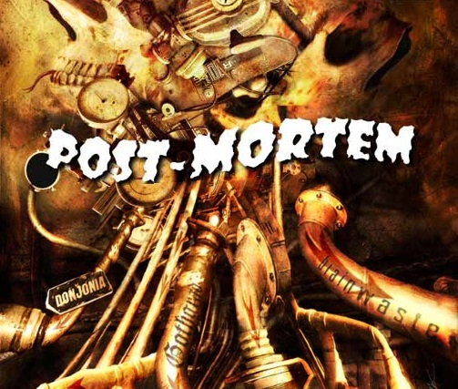

## Liste des post-mortems

...

## Pourquoi ?

Un post-mortem est un retour d'expérience collectif centré sur un incident de prod. C'est une opportunité d'**apprendre** de nos erreurs.
Il s'agit de rassembler les personnes ayant participé au déclenchement, à la détection et à la résolution de l’événement,
afin de **comprendre** ce qu'il s'est passé et **dégager des solutions** pour que cela ne se reproduise pas.
Il doit avoir lieu dans les 48h après l’événement si possible.
L'objectif n'est **surtout pas de blâmer** qui que ce soit, mais d'identifier les problèmes techniques et organisationnels à améliorer: une erreur humaine ne constitue jamais une "root cause".

### Exemples dans l'industrie & ressources

- Un tuto avec un template de PostMortem: https://medium.com/production-ready/writing-your-first-postmortem-8053c678b90f
- Comment Google s'y prend: https://landing.google.com/sre/book/chapters/postmortem-culture.html
Le template de post-mortem de Gitlab : [post_mortem.md](https://gitlab.com/gitlab-com/gl-infra/infrastructure/blob/master/.gitlab/issue_templates/post_mortem.md)
- Un exemple d'outil open-sourcé montrant comment Etsy gère ses post-mortems: https://github.com/etsy/morgue
- ainsi qu'une description de la méthodologie qu'ils utilisent: https://www.infoq.com/articles/postmortems-etsy et https://extfiles.etsy.com/DebriefingFacilitationGuide.pdf
- Un compendium de post-mortems d'accidents chez les géants du web : https://github.com/danluu/post-mortems
- Un postmortem récent suite à un incident avec les serveurs npm : http://blog.npmjs.org/post/147012483540/package-tarball-read-outage-today

## Fonctionnement

### QUAND faire un post-mortem ?

- lorsqu"un incident génère un **impact utilisateur** avec une interruption totale de service OU une longue dégradation partielle
- lorsque plusieurs membres de l'équipe le souhaitent

### A QUEL MOMENT le réaliser ?

**Durant l'incident :** on ne s'en préoccupe **PAS**.

**48h max après l'incident :** on effectue une **réunion**, détaillée ci-dessous, où un **compte-rendu** est rédigé.

### QUI le prend en charge ?

Un **animateur** est désigné dès que la décision de faire un post-mortem est prise.
Idéalement, il ne doit **pas** avoir participé à la résolution de l'incident.

Son rôle est :

- d'organiser la réunion de post-mortem: invitation Outlook avec lien de visioconf + résa salle
- d'inviter des utilisateurs impactés (3 max), s'il en trouve de disponibles
- d'animer la réunion de post-mortem et d'en assurer le timeboxing
- si possible, s'il trouve un volontaire ou qu'il a suffisamment de connaissance de l'incident, de préremplir la page wiki de post-mortem avec de premiers éléments de dashboard et de chronologie

### COMMENT se passe la réunion de post-mortem ?

Durée: 1 heure (on essaie)

QUI participe ?

- l'animateur
- les membres de l'équipe qui ont participé à l'incident
- un échantillon  de 1 à 3 utilisateurs impactés disponibles, en sollicitant en priorité les "lanceur d'alertes"
- tous les membres de l'équipe intéressés, dont un qui sera secrétaire et rédigera le CR dans une page fille de celle-ci en copiant la page de template comme base

### COMMENT on communique dessus ?

Tous nos compte-rendus de post-mortems sont publics et accessibles à partir de cette page.
Par souci de simplicité et de gain de temps, un "template" est utilisé comme point de départ à chaque fois.

Nous mentionnons systématiquement sur le chat de support utilisateurs lorsqu'un post-mortem a été réalisé,
par souci de transparence, mais nous limitons l'envoi d'emails à ce sujet aux événements majeurs.

Les post-mortems sont aussi inclus dans la newsletter mensuelle


## Template

Ton global: factuel, technique, mais n'hésitez pas à glisser un peu d'humour / légèreté (clin d'œil)

### Résumé (5min)

Date de l'incident : //

Date du post-mortem : //

Brève description de l'incident :

Participants à la réunion de post-mortem :

### Impact utilisateur & métriques (10 min)

Points de départs :

- Quel a été l'impact de l'incident ? (interruption / dégradation de service...)
- Qui a été impacté par cet incident ? (combien de personnes environ, des équipes / projets en particuliers...)
- Comment les utilisateurs ont été impactés ?

\+ toutes autres métriques & graphs pertinents pour comprendre les symptômes et les étapes de l'incident

### Chronologie (15min)

- Combien de temps s'est écoulé entre le début de l'incident et sa détection ?
- Combien de temps s'est écoulé entre la détection de l'incident et sa résolution ?

Heure     | Événement
----------|-
00:00 UTC | il s'est passé ceci
00:01 UTC | untel a fait cela

### Ce qui a bien fonctionné / ce qui peut être amélioré (15min)

- Comment l'incident a-t-il été détecté ?
  * Ex : "Le health check docker a bien fait son rôle"
- Est-ce que les systèmes d'alerting ont fonctionné ?
  * Ex : "Le 24x7 nous a bien remonté l'alerte"
- Quelles difficultés y-a-t-il eu à résoudre l'incident ?
  * Ex : "C'était samedi matin, j'avais du mal à aligner les yeux ET la connexion à la machine n'était pas possible"

- Qu'est-ce qui pourrait être mis en œuvre pour réduire la durée de détection ?
  * Ex : "Les notifications au 24x7 n'étaient pas activé pour ce service"
- Qu'est-ce qui pourrait être mis en œuvre pour réduire la durée de résolution ?
  * Ex : "Améliorer le product board de tel asset pour avoir l'architecture et des commandes de diagnostic"
- Qu'est-ce qui aurait pu réduire l'impact de cet incident ?
  * Ex : "Vérifier que j'étais sur la bonne machine avant de lancer le SHUT"

### Actions identifiées (5min)
```
⚠ Attention à identifier les quickwins urgents à traiter, et à les prioriser par rapport aux autres tâches en cours.

Au terme de la réunion de post-mortem, l'objectif est d'avoir identifié des **actions immédiates** pour :

- soit empêcher que l'incident se reproduise
- soit que la prochaine fois on ait plus de visibilité / une meilleure compréhension de ce qu'il se passe
```

Lister ici :

- les actions réalisées avant/durant le Post-Mortem pour améliorer les choses
- taguer les ticket avec le label "Post-Mortem"
  * ils devraient apparaître dans ce dashboard :
- les tickets créés, associés chacun à un porteur.
  * se limiter à 2/3 tickets pour ne pas faire un nouveau backlog
  * prioriser les tickets créés : qu'est-ce qui est vraiment le plus urgent ?
