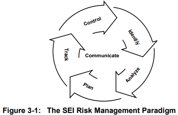

RiskManagement
==============

::: toc
[[toc]]
:::

## Resources

- bonne intro PDF: [Guide de gestion des risques des projets de développement de système](http://collections.banq.qc.ca/ark:/52327/bs53966) - Quebec 2005
- gestion du risque dans un projet Agile: [slideshare](https://fr.slideshare.net/bduplessis/risk-in-agilemanagement)
- [diagramme](http://nkerzazi.adilou.com/Ressources/cmmi/contents_fr_1_2/RSKM_Diagram.html) des critères du modèle CMMI, domaine RSKM
- open source risk tracking tool: https://www.simplerisk.com - [online demo](https://www.simplerisk.com/demo) - [source code on GitHub](https://github.com/simplerisk)

## Définition ?

> Un évênement incertain qui peut impacter le chemin choisi

C'est un phénomène **normal** de la vie d'un projet.

Caractéristiques:
- impact potentiel / gravité des conséquences
- probabilité d'occurence
- fenêtre de temps où le risque peut subvenir / des actions peuvent être mises en oeuvre

## Quelques types de risques

cf. "Taxonomy of Software Development Risks" page 38 of [Taxonomy-Based Risk Identification](https://resources.sei.cmu.edu/library/asset-view.cfm?assetid=11847) - 1993

- risques financiers
- risques juridiques
- risques organisationnels: pratiques agiles, spécifications, manque d'étude...
  * risques de non-agilité: ne pas se fier à l'équipe, commande à l'équipe, faire le travail de l'équipe, ne pas laisser l'équipe évaluer elle-même les risques
  * alignement / besoin : opportunitées manquées, inadéquation des features développées, faible ROI...
- risques humains : manque de compétences/formations, humeur, fatigue de l'équipe, satisfaction du travail réalisé, conflits...
- risques InfoSec : cf. [Threat modeling](https://github.com/Lucas-C/dotfiles_and_notes/blob/master/misc/InfoSec.md#threat-modeling)
- risques d'UX
- risques de QA: bugs
- risques techniques :
  * explosion de complexité
  * limitations dues aux technos
  * maintenabilité de la solution

Beaucoup de ces risques interviennent lors du choix des solutions techniques - cf. :
- [Growing Your Tech Stack: When to Say No](https://blog.codeship.com/growing-tech-stack-say-no/)
- [AYoungLadysPrimerToTechnicalDecisionMaking](https://speakerdeck.com/charity/a-young-ladys-primer-to-technical-decision-making), especially the Manifesto on slide 26

## Comment les adresser ?

- **Accept** / **Avoid** / **Mitigate** (reduce its impact or probability) / **Transfer** / **Research**
- _Continuous Process_: Identify -> Analyze -> Plan -> Track -> Control -> loop

## Mise en application concrète

- _risk board_ de collection des risques, où n'impporte qui peut rajouter un post-it lorsqu'il en identifie un
cf. "Risk Form / Risk Identification Summary" -> [An Introduction to Team Risk Management - 1994](https://resources.sei.cmu.edu/library/asset-view.cfm?assetID=12063) - 1994

- une phase d'**étude** avant le chiffrage d'une US par l'équipe permet d'identifier/comprendre les risques, et ainsi de grandement réduire l'incertitude de l'estimation

### Atelier en équipe d'identification puis classement des risques
**But:** intro à la gestion de risque et identification collective des plus importants pour l'équipe

#### Plan
- préparer à l'avance tableau avec catégories, cachées
- présentation rapide du sujet en 5min
- pendant atelier : afficher diagramme + échelle de proba / gravité + _elevator_ pitch du produit

#### Diagramme des assets de l'équipe
- applicatifs
- technos
- partenaires
- docs, tests, indus, supervision...
- KPIs, pratiques agiles...

Partenaires & clients: Drupal, Expedia, ABTasty, BigData...

#### Exercice collectif
Commencer par énoncer l'objectif final : identifier top 5 risques et des solutions

- 5min top5/top3 individuel (selon nombre participants). Critères:
  * risques qui empêcheraient l'équipe d'atteindre ses objectifs, en 2018
  * on met de côté les risques sur lesquels on ne peut pas agir, ex: relocalisation en Inde
  * chacun essaie de maximiser parmi ses idées la proba / gravité
  * dans un 2e temps, on note une idée de solution au dos
- encore 5min cette fois en assignant les catégories aux personnes
- présentation, aggrégation et estimation proba / gravité de 1 à 4:
la personne qui a enoncé le risque et ses 2 voisins directs votent,
puis discutent jusqu'à se mettre d'accord. Si quelqu'un a identifé le même risque, son score est augmenté de 2.5 points.
- on priorise avec formule arbitraire PxG
- on émet & discute des solutions du top5 (qui diminueraient le risque ou la gravité)

